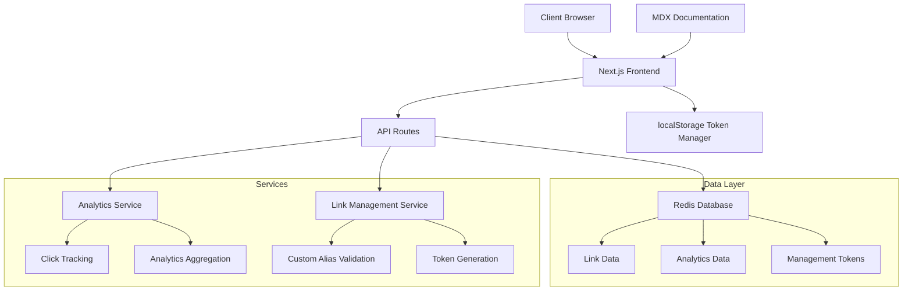

# Design Document

## Overview

This design extends the existing Next.js URL shortener application with advanced features including link tracking analytics, custom short links, token-based management, and interactive API documentation. The architecture maintains the current Redis-based storage while adding comprehensive TypeScript type safety and new data models for analytics and management tokens.

The system follows a serverless architecture using Next.js API routes with Redis as the primary data store. All components will be fully typed with TypeScript, leveraging Zod for runtime validation and ensuring maximum type safety throughout the application.

## Architecture

### Current Architecture Enhancement

The existing architecture uses:
- **Frontend**: Next.js 15 with React 19, TypeScript, Tailwind CSS
- **Backend**: Next.js API routes with Redis storage
- **Validation**: Zod schemas with strict TypeScript types
- **UI Components**: Radix UI with custom styling

### New Architecture Components



## Components and Interfaces

### Core Type Definitions

```typescript
// Enhanced link types with full type safety
interface Link {
  id: string;
  originalUrl: string;
  shortCode: string;
  customAlias?: string;
  managementToken: string;
  createdAt: Date;
  expiresAt?: Date;
  isActive: boolean;
  clickCount: number;
  uniqueVisitors: number;
}

interface ClickEvent {
  id: string;
  linkId: string;
  timestamp: Date;
  ipAddress: string;
  userAgent: string;
  referrer?: string;
  country?: string;
  city?: string;
  device: DeviceInfo;
}

interface DeviceInfo {
  type: 'desktop' | 'mobile' | 'tablet';
  browser: string;
  os: string;
}

interface Analytics {
  linkId: string;
  totalClicks: number;
  uniqueVisitors: number;
  clicksByDay: Record<string, number>;
  topReferrers: Array<{ referrer: string; count: number }>;
  deviceBreakdown: Record<string, number>;
  geographicData: Array<{ country: string; count: number }>;
}

interface ManagementToken {
  token: string;
  linkId: string;
  createdAt: Date;
  lastAccessed: Date;
}
```

### Enhanced Zod Schemas

```typescript
// Extended validation schemas with strict typing
export const createLinkSchema = z.object({
  url: z.string().url().max(512),
  customAlias: z.string()
    .regex(/^[a-zA-Z0-9_-]+$/)
    .min(3)
    .max(50)
    .optional(),
  expiresAt: z.date().optional(),
  turnstileToken: z.string().min(1)
});

export const clickEventSchema = z.object({
  linkId: z.string(),
  ipAddress: z.string().ip(),
  userAgent: z.string(),
  referrer: z.string().url().optional()
});

export const analyticsQuerySchema = z.object({
  linkId: z.string(),
  managementToken: z.string(),
  dateRange: z.enum(['7d', '30d', '90d']).default('30d')
});
```

### API Endpoints Structure

```typescript
// Type-safe API response interfaces
interface CreateLinkResponse {
  success: true;
  data: {
    id: string;
    shortUrl: string;
    managementToken: string;
    customAlias?: string;
  };
}

interface AnalyticsResponse {
  success: true;
  data: Analytics;
}

interface LinkListResponse {
  success: true;
  data: {
    links: Array<Link>;
    pagination: {
      total: number;
      page: number;
      limit: number;
    };
  };
}

interface ErrorResponse {
  success: false;
  error: string;
  code: string;
}
```

## Data Models

### Redis Data Structure

The Redis database will store data using the following key patterns with proper TypeScript interfaces:

```typescript
// Link storage with enhanced data
interface StoredLink {
  id: string;
  originalUrl: string;
  shortCode: string;
  customAlias?: string;
  managementToken: string;
  createdAt: string; // ISO string
  expiresAt?: string; // ISO string
  isActive: boolean;
}

// Analytics storage
interface StoredAnalytics {
  linkId: string;
  totalClicks: number;
  uniqueVisitors: number;
  lastUpdated: string; // ISO string
}

// Click events storage
interface StoredClickEvent {
  id: string;
  linkId: string;
  timestamp: string; // ISO string
  ipAddress: string;
  userAgent: string;
  referrer?: string;
  fingerprint: string; // For unique visitor tracking
}
```

### Redis Key Patterns

- `link:{shortCode}` → StoredLink
- `token:{managementToken}` → linkId
- `analytics:{linkId}` → StoredAnalytics  
- `clicks:{linkId}:{date}` → Array<StoredClickEvent>
- `alias:{customAlias}` → linkId (for uniqueness checking)

### localStorage Token Management

```typescript
interface LocalStorageManager {
  tokens: string[];
  addToken(token: string): void;
  removeToken(token: string): void;
  getTokens(): string[];
  clearTokens(): void;
}

// Type-safe localStorage operations
class TokenManager implements LocalStorageManager {
  private readonly STORAGE_KEY = '1sh_management_tokens';
  
  tokens: string[] = [];
  
  constructor() {
    this.loadTokens();
  }
  
  private loadTokens(): void {
    const stored = localStorage.getItem(this.STORAGE_KEY);
    this.tokens = stored ? JSON.parse(stored) : [];
  }
  
  addToken(token: string): void {
    if (!this.tokens.includes(token)) {
      this.tokens.push(token);
      this.saveTokens();
    }
  }
  
  // Additional methods with full type safety...
}
```

## Error Handling

### Comprehensive Error Types

```typescript
enum ErrorCode {
  INVALID_URL = 'INVALID_URL',
  ALIAS_TAKEN = 'ALIAS_TAKEN',
  INVALID_TOKEN = 'INVALID_TOKEN',
  LINK_NOT_FOUND = 'LINK_NOT_FOUND',
  LINK_EXPIRED = 'LINK_EXPIRED',
  RATE_LIMITED = 'RATE_LIMITED',
  VALIDATION_ERROR = 'VALIDATION_ERROR',
  SERVER_ERROR = 'SERVER_ERROR'
}

class AppError extends Error {
  constructor(
    public code: ErrorCode,
    public message: string,
    public statusCode: number = 400
  ) {
    super(message);
    this.name = 'AppError';
  }
}

// Type-safe error handling utility
function handleApiError(error: unknown): ErrorResponse {
  if (error instanceof AppError) {
    return {
      success: false,
      error: error.message,
      code: error.code
    };
  }
  
  return {
    success: false,
    error: 'An unexpected error occurred',
    code: ErrorCode.SERVER_ERROR
  };
}
```

### Client-Side Error Handling

```typescript
// Type-safe API client with error handling
class ApiClient {
  private async request<T>(
    endpoint: string, 
    options: RequestInit = {}
  ): Promise<T> {
    const response = await fetch(endpoint, {
      headers: {
        'Content-Type': 'application/json',
        ...options.headers
      },
      ...options
    });
    
    const data = await response.json();
    
    if (!data.success) {
      throw new AppError(
        data.code as ErrorCode,
        data.error,
        response.status
      );
    }
    
    return data.data;
  }
  
  async createLink(payload: CreateLinkRequest): Promise<CreateLinkResponse['data']> {
    return this.request<CreateLinkResponse['data']>('/api/v1/links', {
      method: 'POST',
      body: JSON.stringify(payload)
    });
  }
}
```

## Testing Strategy

### Type-Safe Testing Approach

```typescript
// Test utilities with full type safety
interface TestLink extends Omit<Link, 'createdAt'> {
  createdAt: string; // ISO string for JSON serialization
}

interface MockApiResponse<T> {
  success: boolean;
  data?: T;
  error?: string;
  code?: ErrorCode;
}

// Factory functions for test data
function createMockLink(overrides: Partial<TestLink> = {}): TestLink {
  return {
    id: 'test-id',
    originalUrl: 'https://example.com',
    shortCode: 'abc123',
    managementToken: 'token-123',
    createdAt: new Date().toISOString(),
    isActive: true,
    clickCount: 0,
    uniqueVisitors: 0,
    ...overrides
  };
}

// Type-safe API mocking
function mockApiResponse<T>(data: T): MockApiResponse<T> {
  return { success: true, data };
}

function mockApiError(error: string, code: ErrorCode): MockApiResponse<never> {
  return { success: false, error, code };
}
```

### Testing Categories

1. **Unit Tests**: Individual functions and components with TypeScript type checking
2. **Integration Tests**: API endpoints with full request/response type validation
3. **E2E Tests**: Complete user flows with type-safe page object models
4. **Type Tests**: Compile-time type checking for all interfaces and schemas

### MDX Documentation Testing

```typescript
// Type-safe documentation component testing
interface DocExample {
  title: string;
  code: string;
  language: 'javascript' | 'typescript' | 'curl';
  response: unknown; // Will be validated against response schemas
}

interface ApiDocSection {
  endpoint: string;
  method: 'GET' | 'POST' | 'PUT' | 'DELETE';
  description: string;
  requestSchema: z.ZodSchema;
  responseSchema: z.ZodSchema;
  examples: DocExample[];
}
```

## Performance Considerations

### Caching Strategy

```typescript
interface CacheConfig {
  ttl: number; // Time to live in seconds
  key: string;
  tags: string[]; // For cache invalidation
}

// Type-safe caching utility
class RedisCache {
  async get<T>(key: string, schema: z.ZodSchema<T>): Promise<T | null> {
    const cached = await client.get(key);
    if (!cached) return null;
    
    try {
      const parsed = JSON.parse(cached);
      return schema.parse(parsed);
    } catch {
      await client.del(key); // Remove invalid cache
      return null;
    }
  }
  
  async set<T>(key: string, value: T, ttl?: number): Promise<void> {
    const serialized = JSON.stringify(value);
    if (ttl) {
      await client.setex(key, ttl, serialized);
    } else {
      await client.set(key, serialized);
    }
  }
}
```

### Analytics Optimization

- **Real-time tracking**: Immediate click recording with async analytics processing
- **Batch processing**: Aggregate analytics data every 5 minutes
- **Data retention**: Keep detailed click events for 90 days, aggregated data indefinitely
- **Efficient queries**: Use Redis sorted sets for time-based analytics queries

## Security Considerations

### Token Security

```typescript
// Cryptographically secure token generation
import { randomBytes } from 'crypto';

function generateManagementToken(): string {
  return randomBytes(32).toString('base64url');
}

// Token validation with timing-safe comparison
function validateToken(provided: string, stored: string): boolean {
  if (provided.length !== stored.length) return false;
  
  let result = 0;
  for (let i = 0; i < provided.length; i++) {
    result |= provided.charCodeAt(i) ^ stored.charCodeAt(i);
  }
  return result === 0;
}
```

### Input Validation

- **Strict Zod schemas**: All inputs validated with comprehensive schemas
- **URL validation**: Prevent malicious URLs and ensure proper formatting
- **Rate limiting**: Implement per-IP rate limiting for link creation
- **CORS configuration**: Proper CORS headers for API access

### Data Privacy

- **IP anonymization**: Hash IP addresses for analytics while preserving uniqueness
- **No persistent user data**: Only store management tokens, no personal information
- **Automatic cleanup**: Remove expired links and old analytics data